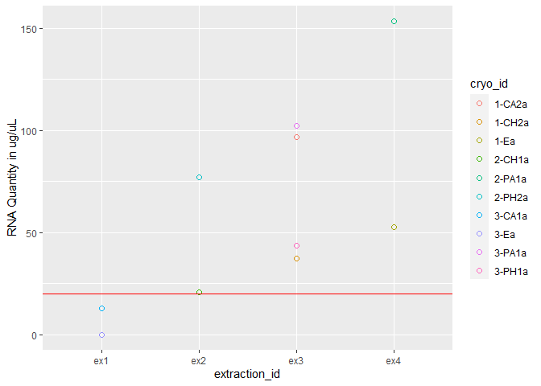
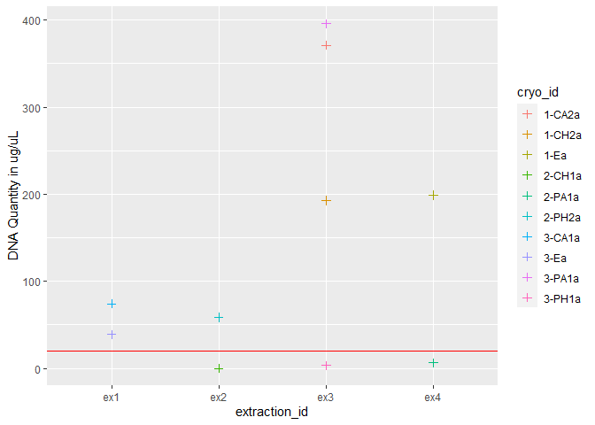
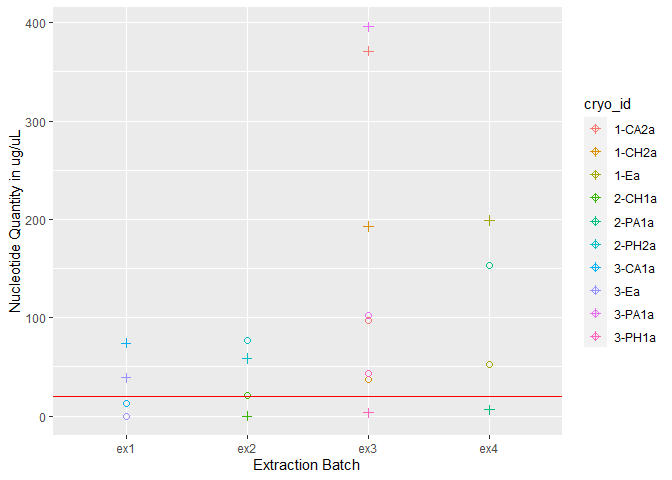

Sorting Out the Best Extractions
================

``` r
library(tidyverse)
```

    Warning: package 'tidyverse' was built under R version 4.2.3

    Warning: package 'ggplot2' was built under R version 4.2.3

    Warning: package 'tidyr' was built under R version 4.2.3

    Warning: package 'readr' was built under R version 4.2.3

    Warning: package 'purrr' was built under R version 4.2.3

    Warning: package 'stringr' was built under R version 4.2.3

    Warning: package 'forcats' was built under R version 4.2.3

    Warning: package 'lubridate' was built under R version 4.2.3

    ── Attaching core tidyverse packages ──────────────────────── tidyverse 2.0.0 ──
    ✔ dplyr     1.1.2     ✔ readr     2.1.4
    ✔ forcats   1.0.0     ✔ stringr   1.5.0
    ✔ ggplot2   3.4.2     ✔ tibble    3.2.1
    ✔ lubridate 1.9.2     ✔ tidyr     1.3.0
    ✔ purrr     1.0.1     
    ── Conflicts ────────────────────────────────────────── tidyverse_conflicts() ──
    ✖ dplyr::filter() masks stats::filter()
    ✖ dplyr::lag()    masks stats::lag()
    ℹ Use the conflicted package (<http://conflicted.r-lib.org/>) to force all conflicts to become errors

``` r
library(ggplot2)
library(readr)
```

``` r
extr_meta <- read_csv("../data/extractions_metadata.csv")
```

    Rows: 280 Columns: 19
    ── Column specification ────────────────────────────────────────────────────────
    Delimiter: ","
    chr (12): cryo_id, pae_treatment, temp_treatment, tank, cryo_rep, pae_ugL, f...
    dbl  (7): colony, qubit_rna_1, qubit_rna_2, qubit_rna_3, qubit_dna_1, qubit_...

    ℹ Use `spec()` to retrieve the full column specification for this data.
    ℹ Specify the column types or set `show_col_types = FALSE` to quiet this message.

``` r
head(extr_meta)
```

    # A tibble: 6 × 19
      cryo_id colony pae_treatment temp_treatment tank  cryo_rep pae_ugL freeze_date
      <chr>    <dbl> <chr>         <chr>          <chr> <chr>    <chr>   <chr>      
    1 1-Ea         1 environmental kbay           na    a        na      8/5/2022   
    2 1-Eb         1 environmental kbay           na    b        na      8/5/2022   
    3 2-Ea         2 environmental kbay           na    a        na      8/5/2022   
    4 2-Eb         2 environmental kbay           na    b        na      8/5/2022   
    5 3-Ea         3 environmental kbay           na    a        na      8/5/2022   
    6 3-Eb         3 environmental kbay           na    b        na      8/5/2022   
    # ℹ 11 more variables: cull_notes <chr>, extraction_id <chr>, extr_date <chr>,
    #   qubit_rna_run_date <chr>, qubit_rna_1 <dbl>, qubit_rna_2 <dbl>,
    #   qubit_rna_3 <dbl>, qubit_dna_run_date <chr>, qubit_dna_1 <dbl>,
    #   qubit_dna_2 <dbl>, qubit_dna_3 <dbl>

``` r
extracted <- extr_meta %>%
  filter(!is.na(extraction_id))
head(extracted, 10)
```

    # A tibble: 10 × 19
       cryo_id colony pae_treatment temp_treatment tank  cryo_rep pae_ugL
       <chr>    <dbl> <chr>         <chr>          <chr> <chr>    <chr>  
     1 1-Ea         1 environmental kbay           na    a        na     
     2 3-Ea         3 environmental kbay           na    a        na     
     3 1-CA2a       1 control       ambient        A2    a        0      
     4 1-CH2a       1 control       hot            H2    a        0      
     5 2-CH1a       2 control       hot            H1    a        0      
     6 2-PA1a       2 peak          ambient        A1    a        150    
     7 2-PH2a       2 peak          hot            H2    a        150    
     8 3-CA1a       3 control       ambient        A1    a        0      
     9 3-PA1a       3 peak          ambient        A1    a        150    
    10 3-PH1a       3 peak          hot            H1    a        150    
    # ℹ 12 more variables: freeze_date <chr>, cull_notes <chr>,
    #   extraction_id <chr>, extr_date <chr>, qubit_rna_run_date <chr>,
    #   qubit_rna_1 <dbl>, qubit_rna_2 <dbl>, qubit_rna_3 <dbl>,
    #   qubit_dna_run_date <chr>, qubit_dna_1 <dbl>, qubit_dna_2 <dbl>,
    #   qubit_dna_3 <dbl>

``` r
# Make RNA average column and move to after 3rd reading `qubit_rna_3`
extracted <- extracted %>% 
  mutate(
    qubit_rna_avg = rowMeans(select(.,qubit_rna_1, qubit_rna_2, qubit_rna_3))) %>%
    relocate(qubit_rna_avg, .after = qubit_rna_3) 

# Make DNA average column and move to after 3rd reading `qubit_dna_3`   
extracted <- extracted %>% 
  mutate(   
    qubit_dna_avg = rowMeans(select(.,qubit_dna_1, qubit_dna_2, qubit_dna_3))) %>%
    relocate(qubit_dna_avg, .after = qubit_dna_3)
```

``` r
# subset to review Qubit Scores
qubit_scores <- extracted  %>%
  select(cryo_id, qubit_dna_avg, qubit_rna_avg)

print(qubit_scores)
```

    # A tibble: 10 × 3
       cryo_id qubit_dna_avg qubit_rna_avg
       <chr>           <dbl>         <dbl>
     1 1-Ea           199             52.7
     2 3-Ea            38.8            0  
     3 1-CA2a         371.            96.8
     4 1-CH2a         193.            37.1
     5 2-CH1a           0             20.8
     6 2-PA1a           6.3          153. 
     7 2-PH2a          58.5           77.1
     8 3-CA1a          74.1           12.9
     9 3-PA1a         396            102. 
    10 3-PH1a           3.23          43.4

``` r
# Create base scatterplot
rna <- ggplot(data = extracted, aes(x = extraction_id, y = qubit_rna_avg, color = cryo_id)) +
  geom_point(size = 2, shape = 1) + 
  ylab("RNA Quantity in ug/uL") + 
  geom_hline(yintercept = 20, linetype = "solid", color = "red")

# save the plot as an PNG file
ggsave("../output/rna.png", plot = rna, width = 8, height = 4, dpi = 600)

# View plot
rna
```



``` r
dna <- ggplot(data = extracted, aes(x = extraction_id, y = qubit_dna_avg, color = cryo_id)) +
  geom_point(size = 2, shape = 3) + 
  ylab("DNA Quantity in ug/uL") + 
  geom_hline(yintercept = 20, linetype = "solid", color = "red")

# save the plot as an PNG file
ggsave("../output/dna.png", plot = dna, width = 8, height = 4, dpi = 600)

# View plot
dna
```



``` r
rna_dna <- rna +
  geom_point(data = extracted, aes(x = extraction_id, y = qubit_dna_avg, color = cryo_id), size = 2, shape = 3) +
  scale_shape_manual(name = "Nucleotides", values = c(0, 2), labels = c("RNA", "DNA")) +
  ylab("Nucleotide Quantity in ug/uL") + 
  xlab("Extraction Batch")

# save the plot as an PNG file
ggsave("../output/rna_dna.png", plot = rna_dna, width = 8, height = 4, dpi = 600)

# View plot
rna_dna
```


